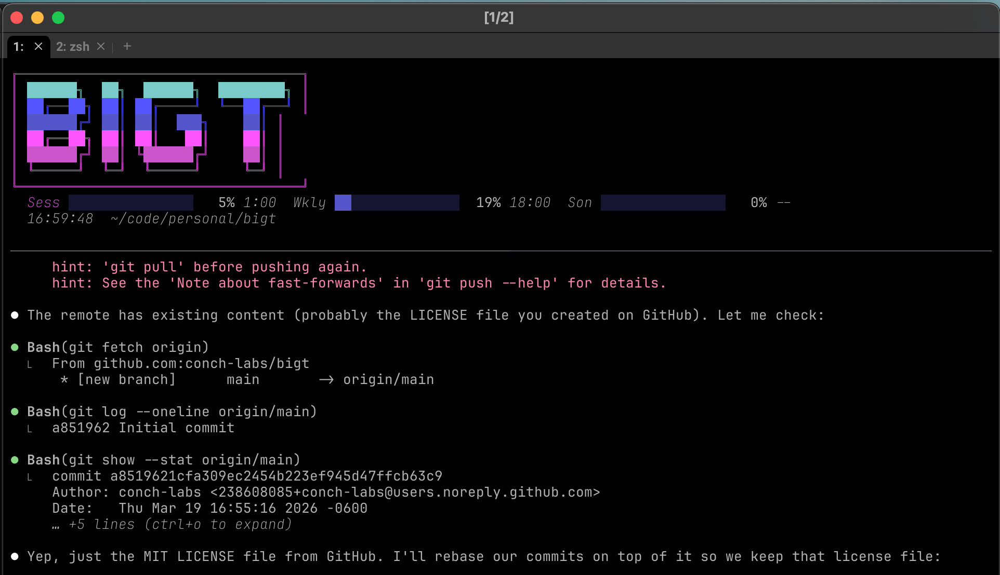

# bigt

Big ASCII terminal banners with Claude Max usage meters.

Designed to make it easy to tell your terminal windows apart when you have 20+ open. Runs in tmux with a banner pane on top and your shell below.



## Features

- Custom block-character font with synthwave color gradients
- 7 built-in color schemes (synthwave, cyberpunk, ocean, fire, forest, pastel, purple)
- 3 size levels: normal, `+`, `++`
- Claude Max usage meter (session, weekly, sonnet limits with progress bars)
- Usage daemon (`bigt-usaged`) polls the API once every 5 minutes so multiple terminals share a single data source
- tmux integration with split panes, mouse support, and auto-resize
- Figlet font support via `--font` or interactive font picker

## Requirements

- **macOS** (usage meter reads OAuth tokens from macOS Keychain)
- **Python 3.9+**
- **tmux** (`brew install tmux`)
- **Claude Code** installed and logged in (for the usage meter — optional, bigt works without it)

WezTerm is recommended but any terminal works.

## Install

```bash
brew install tmux

# from the bigt directory
pipx install .
# or
pip install .
```

## Usage

```bash
bigt "my project"              # default synthwave banner + shell in tmux
bigt "my project" +            # medium size
bigt "my project" ++           # large size
bigt "my project" -s fire      # fire color scheme
bigt "my project" -f slant     # use a figlet font
bigt "my project" --no-persist # just print the banner and exit
bigt --themes                  # preview all color schemes
bigt --list-fonts              # list available figlet fonts
bigt --usage                   # show usage meter only
```

## Claude Max Usage Meter

If you have [Claude Code](https://docs.anthropic.com/en/docs/claude-code) installed and logged in, bigt automatically displays your Claude Max usage limits:

- Session (5-hour) limit
- Weekly all-models limit
- Weekly Sonnet-only limit
- Time until each limit resets

No API key or extra config needed — bigt reads the OAuth token that Claude Code stores in your macOS Keychain.

### Usage daemon

Instead of every terminal hitting the Anthropic API independently, `bigt-usaged` runs as a background daemon that fetches usage data once every 5 minutes and serves it to all terminals over a Unix socket (`~/.cache/bigt/usage.sock`).

The daemon starts automatically when needed. To manage it manually:

```bash
bigt-usaged              # start in background (daemonized)
bigt-usaged --foreground # start in foreground (for debugging)
bigt-usaged --stop       # stop the daemon
```

The daemon auto-shuts down after 30 minutes of inactivity. On API failures it backs off exponentially (1m, 2m, 4m... up to 15m).

## Recommended tmux config

Add these to `~/.tmux.conf` for a better experience:

```bash
# Mouse support (scroll, click panes, resize)
set -g mouse on

# Copy/paste (macOS)
set -s copy-command 'pbcopy'

# Scroll history
set -g history-limit 10000
```

## License

MIT
